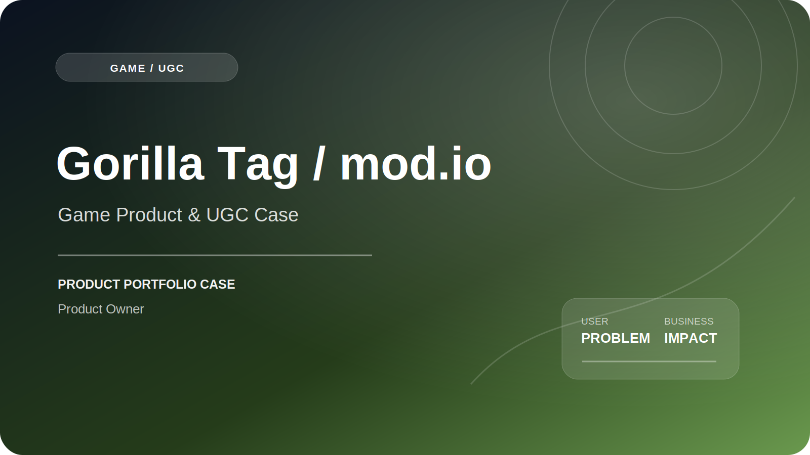

# Gorilla Tag / mod.io — Game Product & UGC Case

   

**Продуктовый подход к UGC-сценариям: поиск, установка, совместимость, публикация контента и модерация.**

[Публичная страница](https://mod.io/g/gorilla-tag)

## Контекст продукта

В UGC-сценарии игроку нужно найти совместимый пользовательский контент, установить его и успешно запустить. Автору — подготовить версию, заполнить метаданные, пройти проверку и обновлять публикацию.

## Проблема пользователя и бизнеса

- игроку сложно оценить совместимость и качество до установки;
- ошибка загрузки или запуска разрушает основную ценность;
- автору неясны требования и причины отклонения;
- платформе нужно обеспечивать безопасность, качество и управляемую модерацию.

## Моя роль

1. Формировал и приоритизировал backlog игрового продукта.
2. Планировал MVP и выделял критический путь.
3. Декомпозировал игровые механики и пользовательские сценарии.
4. Готовил требования и критерии готовности.
5. Координировал разработку, дизайн и QA в команде 10+ специалистов.
6. Контролировал зависимости, риски и готовность релиза.
7. Собирал обратную связь для уточнения сценариев.

## Основной пользовательский путь

`Каталог → Поиск / фильтр → Карточка → Совместимость → Установка → Запуск → Оценка / обновление`

## Продуктовый фокус

| Область | Проблема / риск | Решение или критерий качества |
|---|---|---|
| Discovery | Трудно найти релевантный контент | Поиск, фильтры, категории и понятные метаданные |
| Compatibility | Риск неуспешного запуска | Версия, требования и предупреждения до установки |
| Installation | Непрозрачный прогресс или ошибка | Состояния загрузки, retry и диагностика |
| Publishing | Автор не понимает статус | Чёткие требования, модерация и причины отклонения |

## Результат и impact

Кейс показывает подход Product Owner к MVP, backlog и контролю релизных рисков. Командные процессные показатели из игрового опыта не привязаны в README к официальным метрикам Gorilla Tag или mod.io.

## Metric framework

**North Star:** успешные игровые сессии с установленным UGC-контентом.

**Воронка:**  
`Catalog view → Content detail → Install start → Install success → Launch → Repeat use`

**Ключевые метрики:**

- install success rate;
- install-to-launch conversion;
- repeat UGC use;
- update success rate;
- creator activation;
- publish completion rate;
- moderation turnaround time.

**Guardrails:**

- вредоносный или запрещённый контент;
- несовместимые версии;
- crashes;
- жалобы;
- нагрузка на поддержку.

## Артефакты Product Manager

- MVP scope;
- prioritized backlog;
- User Stories и Acceptance Criteria;
- dependency map;
- risk register;
- release plan;
- QA checklist;
- feedback backlog.

## Важное уточнение

Репозиторий не аффилирован с Another Axiom, Gorilla Tag или mod.io и не заявляет авторство платформы, игры или публичного каталога. Перед публикацией следует уточнить конкретную механику или релиз, за который вы отвечали.

## Ограничения публикации

Репозиторий является портфолио-кейсом. Он не содержит production-код, внутренние документы, доступы, персональные данные, коммерческую аналитику или материалы, защищённые NDA. Официальный продукт и торговые марки принадлежат их владельцам; моя зона ответственности ограничена описанным выше scope.

## Компетенции

`Product Ownership` · `Game Product` · `UGC` · `MVP` · `Backlog Management` · `Game Mechanics` · `Risk Management` · `Release Planning`
